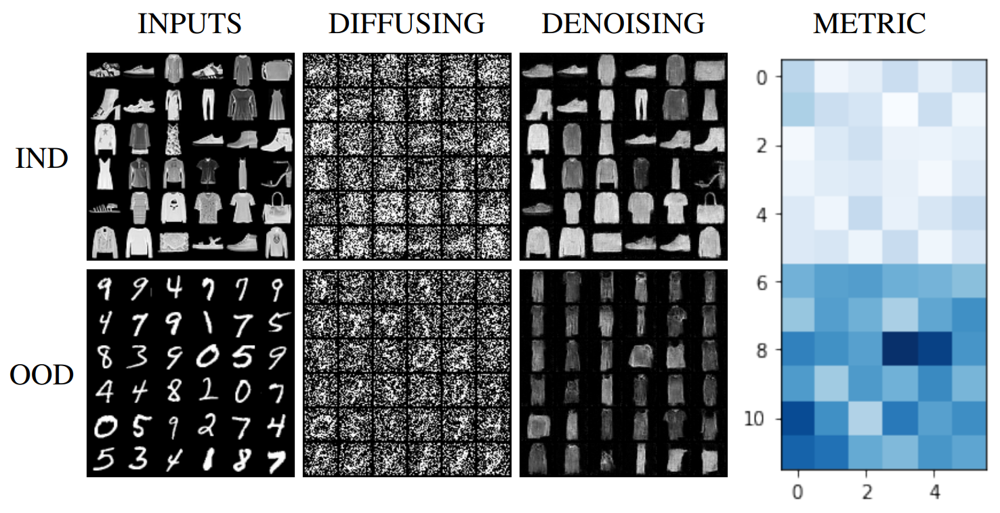

# Diffusing and denoising samples for out-of-distribution detection

This repo contains a PyTorch implementation for the paper [Diffusing and denoising samples for out-of-distribution detection](https://openreview.net/forum?id=eATJn1VZQia)

by [Gabriel Raya](https://gabrielraya.com/), [Juan Sebastian Olier Jauregui](https://www.tilburguniversity.edu/staff/j-s-olier), and [Eric Postma](https://ericpostma.nl/), 

--------------------
We propose Diffusing and Denoising OOD Samples (DDOS), a new unsupervised method for out-of-distribution detection
that consists of partially diffusing and denoising data with score-based diffusion generative models (SDMs).
In particular, we show that we can successfully reconstruct partially diffused in-distribution samples, indicating a low reconstruction error.
However, OOD samples are pushed far from their initial state resulting in a high reconstruction error. Finally, this reconstruction error is used to
distinguish in- from OOD samples, yielding an AUROC of 0.98 on FashionMNIST vs. MNIST.

The basic idea is captured in the figure below: 

